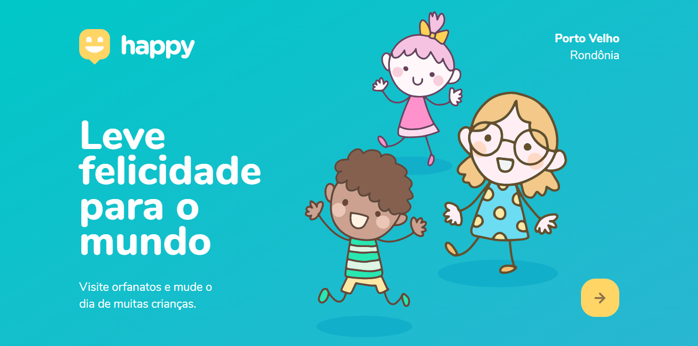

# Happy NLW#3

<h3>Projeto desenvolvido na Next Level Week 3 pela <a href="https://rocketseat.com.br/">Rocketseat</a></h3>

 
O evento foi íncrivel, fiquei surpresa de como foi bem organizado, e em como foi feita a interação com os os participantes, não foi chato como a maioria dos eventos online que acontece, já estou ansiosa pelo próximo!
 

 
<main>
<h2>Happy</h2>
  <h4>Visite um orfanato!</h4>
  

   <i>O projeto tem como inspiração as Instituições de Caridade, que realizam um trabalho muito importante no mundo. E tem como intenção incentivar a visitação de crianças em orfanatos, que é uma coisa linda ver a felicidade de crianças. 
      E o desafio da semana, era propor não só programar, mas também nos trazer uma pequena reflexão. 😀 
     Vamos levar felicidade para o mundo! 😊</i>
 
    <strong>
<a href="https://github.com/felipecastrosales/Happy">felipecastrosales</a>
</strong>

<h2 align="center">Prévia 💻</h2>

<h2 align="center">Tecnologias 🚀</h2>

- [Node.js](https://nodejs.org/en/)
- [Express](https://expressjs.com/pt-br/)
- [SQLite](https://www.sqlite.org/index.html)
- [Handlebars](https://handlebarsjs.com/)
- [JavaScript](https://www.javascript.com/)
- [CSS](https://developer.mozilla.org/pt-BR/docs/Web/CSS)
- [HTML](https://html.com/)

</main>
